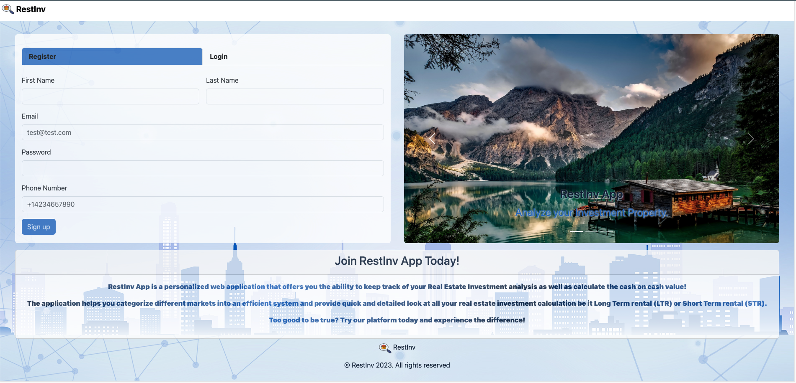

# RESTINV

A real estate investment cash-on-cash calculator app where users can add property and calculate the cash-on-cash returns.

## Tech Stack
- Java
- Spring Boot
- Spring Security
- PostgreSQL
- JavaScript
- HTML
- CSS
- YAddress API
- Census.gov API
- Cloudinary API

## Installation and Setup


### Required downloads

- Java 17
- Spring-boot
- Maven
- PostgreSQL

### PostgreSQL Database Setup

Before you start, make sure you have PostgreSQL installed on your system. If not, download and install it from the official [the official PostgreSQL site](https://www.postgresql.org/download/).

To set up the "RestInv" PostgreSQL database, follow these steps:

1. Open your command line interface and start PostgreSQL with the psql command.
2. Create the "restinv" database with this command:
   ```
   CREATE DATABASE restinv;
   ```
3. Set up your application.properties file with database username , password etc.


### Clone the Repository

```
https://github.com/monishajacob/RestInv.git
```


### Navigate to the Project Directory

```
cd RestInv/
```

```
mvn clean install

```

Start the application: Start the Spring Boot application by running

```
mvn spring-boot:run

```

## Getting Started

Now RestInv should be accessible from [port 8080](http://localhost:8080/api/v1/restinv/)


## Application Walkthrough

Login/Register:



Market:


View Property:


Create Property:


View Property Calculation:


